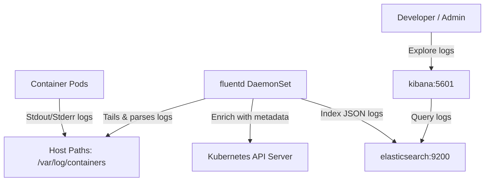

# Custom EFK (Elasticsearch, Fluentd, Kibana) Logging Stack

This directory contains the Dockerfile, custom Ruby plugins, and Kubernetes manifests to build and deploy a custom **EFK logging stack** on GKE/Kubernetes. 

The stack consists of a custom **Fluentd** log collector running as a DaemonSet to gather logs from nodes, **Elasticsearch** for storage and indexing, and **Kibana** for search and visualisation.

---

## Architecture Flow

The logging pipeline moves log events through the cluster as follows:



1. **Log Output**: All pod containers write standard logs (stdout/stderr) which are saved on GKE nodes under `/var/log/containers/*.log` in the Container Runtime Interface (CRI) format.
2. **Collection & Scraping**: Fluentd runs on every node as a **DaemonSet**. It mounts host log paths, tails the container log files, and parses the CRI format.
3. **Metadata Enrichment**: The `fluent-plugin-kubernetes_metadata_filter` plugin queries the Kubernetes API server using a local service account to enrich log records with metadata (e.g. namespace, pod name, labels, annotations).
4. **Structured JSON Flattening**: Fluentd parses the log messages. If the log message itself is structured JSON (like application logging), it flattens the nested JSON structure so Elasticsearch can index the individual fields.
5. **Storage & Search**: Logs are shipped to Elasticsearch and visualized in Kibana.

---

## Custom Docker Image

A custom Fluentd image is required to bundle the necessary Ruby gems and plugins to work with GKE container runtimes and Elasticsearch.

### Bundled Plugins & Gemfile
The image packages the following key dependencies:
* `fluent-plugin-elasticsearch`: To ship logs to Elasticsearch.
* `fluent-plugin-kubernetes_metadata_filter`: To enrich logs with Kubernetes context.
* `fluent-plugin-concat` & `fluent-plugin-detect-exceptions`: To automatically reconstruct multi-line log exceptions (like Java stack traces).
* Custom Ruby parser plugins located in `plugins/` (`parser_kubernetes.rb` and `parser_multiline_kubernetes.rb`).

### How to Build & Push
To build and publish the custom image:
```bash
docker build -t <your-registry>/fluentd-custom:latest .
docker push <your-registry>/fluentd-custom:latest
```
*Note: Make sure to update the container image name under the `spec.template.spec.containers[0].image` field in `k8s/fluentd.yaml` to point to your repository.*

---

## Configuration Reference

### Fluentd Configuration (`k8s/fluented-configmap.yaml`)
* **Regexp CRI Parsing**: Parses CRI-O / containerd style log formats to isolate timestamp, stream source (stdout/stderr), and the log message text:
  ```apache
  expression ^(?<time>\d{4}-\d{2}-\d{2}T\d{2}:\d{2}:\d{2}.[^Z]*Z)\s(?<stream>[^\s]+)\s(?<character>[^\s])\s(?<message>.*)$
  ```
* **JSON Parsing**: Detects if `message` contains a JSON string and flattens it into structured fields:
  ```apache
  <filter kubernetes.**>
    @type parser
    key_name message
    reserve_data true
    remove_key_name_field true
    <parse>
      @type json
    </parse>
  </filter>
  ```

### RBAC Settings (`k8s/rbac.yaml`)
To fetch Kubernetes metadata, Fluentd runs under the `fluentd` service account with permission to query namespaces and pods:
```yaml
rules:
- apiGroups: [""]
  resources: ["pods", "namespaces"]
  verbs: ["get", "list", "watch"]
```

---

## Deployment Steps

Deploy the components in the following order:

### 1. Deploy Elasticsearch and Kibana
Elasticsearch and Kibana are deployed to the `elastic-kibana` namespace (which you should create or align with your setup):
```bash
kubectl create namespace elastic-kibana
kubectl apply -f k8s/elastic.yaml -n elastic-kibana
kubectl apply -f k8s/kibana.yaml -n elastic-kibana
```

### 2. Deploy Fluentd RBAC & ConfigMap
Deploy the ServiceAccount, ClusterRole bindings, and Fluentd configuration:
```bash
kubectl create namespace fluentd
kubectl apply -f k8s/rbac.yaml
kubectl apply -f k8s/fluented-configmap.yaml
```

### 3. Deploy Fluentd DaemonSet
Ensure your custom image is updated in `k8s/fluentd.yaml` if you built your own. Otherwise, deploy the manifest:
```bash
kubectl apply -f k8s/fluentd.yaml
```

---

## Verification & Log Exploration

### 1. Deploy a Testing Log App
Deploy a simple `counter` pod that generates synthetic logs once every second:
```bash
kubectl apply -f k8s/counter-example-app.yaml
```

### 2. Verify Ingestion
Check that all pods are running successfully:
```bash
kubectl get pods -A | grep -E "fluentd|elastic|kibana|counter"
```

### 3. Explore Logs in Kibana
1. Get the external IP of the Kibana service:
   ```bash
   kubectl get svc kibana -n elastic-kibana
   ```
2. Open your browser and navigate to `http://<kibana-external-ip>:5601`.
3. Go to **Management** -> **Stack Management** -> **Index Patterns** -> **Create Index Pattern**.
4. Set the pattern to `fluentd-k8s*` and select `@timestamp` as the primary time field.
5. Go to **Discover** to search, filter, and analyze GKE container logs in real time!
