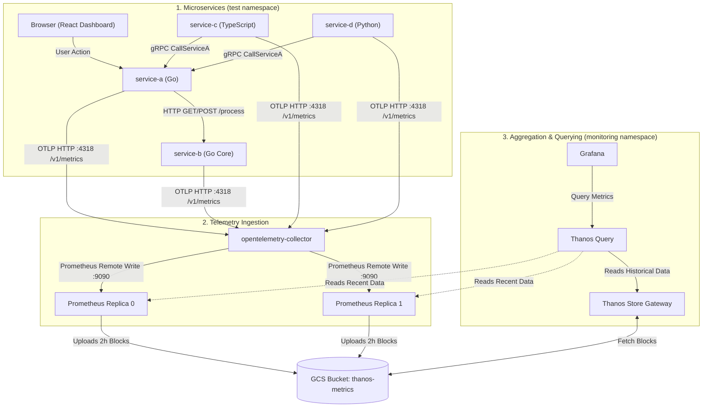

# Multi-Service Kubernetes Monitoring & Ops Stack

[](https://kubernetes.io)
[](https://prometheus.io)
[](https://thanos.io)
[](https://opentelemetry.io)
[](https://grafana.com)
[](https://go.dev)
[](https://nodejs.org)
[](https://python.org)

An end-to-end containerized microservices stack deployed on GKE demonstrating automated Logging, Tracing, Metrics flow, and request correlation through a fully integrated Prometheus/Thanos long-term metric storage pipeline.

---

## 🚀 Recent Infrastructure Activities Completed

We have successfully configured, deployed, and validated the following stack capabilities:

1. **Thanos Query & Storage Architecture**:
   * Integrated **Thanos Sidecars** into the Prometheus replicas.
   * Deployed **Thanos Query** for global PromQL aggregation and deduplication.
   * Configured **Thanos Store Gateway** and **Thanos Compactor** to fetch and downsample historical block metrics directly from Google Cloud Storage (`gs://thanos-metrics-k8s-staging-252732`).
   * Configured **GKE Workload Identity** mappings on Thanos and Prometheus service accounts to securely authenticate to GCS without using static JSON service account keys.
2. **Cluster Ingress & Routing Setup**:
   * Built a unified GKE Gateway routing layout using `HTTPRoute` mappings.
   * Configured `cert-manager` TLS certificates for all stack components:
     * Grafana: `http://grafana.prakriti.website`
     * Prometheus: `http://prometheus.prakriti.website`
     * Test Apps: `http://test.prakriti.website`
3. **Pod Downward API & Metrics Optimization**:
   * Updated the Helm chart templates for all backend microservices (`service-a`, `service-b`, `service-c`, `service-d`).
   * Configured the Kubernetes **Downward API** to automatically inject the pod name and pod namespace into the container's environment under `OTEL_RESOURCE_ATTRIBUTES`.
   * This enables OpenTelemetry to attach pod identities to standard counter/histogram metrics, allowing you to filter application RED throughput and latency by individual pods in Grafana.

---

## 📊 End-to-End Metrics & Telemetry Pipeline



---

## 🛠️ Technology Stack & Core Tools

| Category | Technology / Tool | Purpose |
| :--- | :--- | :--- |
| **Instrumentation** | **OpenTelemetry SDKs** | Standardizes metric and trace output from Go, Python, and TypeScript services. |
| **Collection** | **OpenTelemetry Collector** | Receives OTLP metrics over HTTP and exports to Prometheus via Remote Write. |
| **Active Storage** | **Prometheus (Operator)** | Operates highly-available replicas collecting real-time TSDB metrics. |
| **Long-term Storage**| **Thanos / GCS** | Compacts, downsamples, and archives metrics blocks into cloud storage. |
| **Visualization** | **Grafana** | Centralized dashboards query Thanos Query by default for seamless historical analysis. |
| **Ingress Controller**| **GKE Gateway API** | Manages GKE Gateway routes, GKE HealthCheckPolicies, and TLS terminations. |

---

## 📁 Repository Layout

```text
monitoring-ops-stack/
├── gateway/               # Shared GKE Gateway configurations and certificates
├── logging/               # Grafana Loki and Promtail logging stack configs
├── metrics/               # Metrics collection configurations
│   ├── thanos/            # Thanos query, compact, and storage configs
│   └── community/         # Standard Prometheus configuration values (without Thanos)
├── test/                  # Interconnected microservices testbed (service-a to e)
│   └── kustomize/         # Local test application Helm charts & gateway routes
└── README.md              # Main project layout and summaries (this file)
```

---

## 📝 Verification Commands

### Deploy the Metrics & Thanos Stack
```bash
kubectl kustomize metrics --enable-helm | kubectl apply --server-side --force-conflicts -f -
```

### Deploy the Test Microservices Stack
```bash
kubectl kustomize test/kustomize --enable-helm | kubectl apply --server-side --force-conflicts -f -
```

### Restart Test Workloads (Reload Env)
```bash
kubectl rollout restart deployment -n test
```