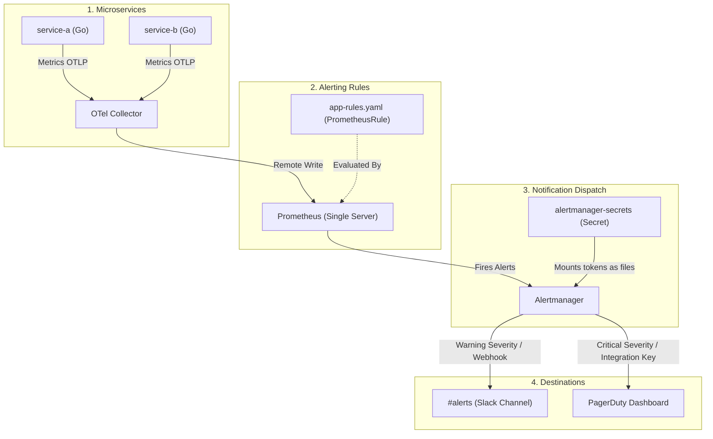

# Alerting & Alertmanager Stack Deployment

This directory contains the configurations and deployment steps for the **Prometheus & Alertmanager stack**, fully configured with custom alerting rules and secure external access via GKE Gateway.

---

## 📊 Ingress & Notification Flow

The alerting system is designed to route application health issues directly from active pods through to Slack channels and PagerDuty on-call notification policies.



---

## 🛠️ Components List

1. **Prometheus Operator**: Configured to load custom metric rules matching the release label (`release: monitoring`).
2. **Alertmanager**: Setup with:
   * **Secrets Mount**: Dynamically mounts the `alertmanager-secrets` Kubernetes Secret containing integration credentials.
   * **Route Definitions**: Default warnings go to Slack; critical alerts page PagerDuty and notify Slack.
3. **GKE Gateway Ingress Routes**: Maps endpoints using GKE Gateway API:
   * **Prometheus**: `prometheus.prakriti.website` (Port `9090`)
   * **Alertmanager**: `alertmanager.prakriti.website` (Port `9093`)
   * **HealthChecks**: Target check path `/-/healthy` configured for both services.

---

## 📝 Custom Alert Rules

Defined in **[`app-rules.yaml`](file:///r:/Devops%20territory/monitoring-ops-stack/alerting/app-rules.yaml)**:

* **`HighHttpErrorRate` (Critical)**: Triggers if HTTP 5xx error rate exceeds 5% for a route over a 5-minute period.
* **`HighRequestLatency` (Warning)**: Triggers if the 95th percentile latency is above 2s.
* **`TestServiceDown` (Critical)**: Triggers if a target/pod in the `test` namespace goes offline.

---

## 🔒 Configuration & Secrets Management

To avoid exposing production Slack URLs or PagerDuty keys in git repositories:
- Credentials are defined in **[`alertmanager-secrets-resource.yaml`](file:///r:/Devops%20territory/monitoring-ops-stack/alerting/alertmanager-secrets-resource.yaml)** as a Kubernetes Secret.
- The Helm configuration in **[`prometheus-grafana-stack.yaml`](file:///r:/Devops%20territory/monitoring-ops-stack/alerting/prometheus-grafana-stack.yaml)** mounts the secret to `/etc/alertmanager/secrets/alertmanager-secrets/` and uses `api_url_file` and `service_key_file` to point directly to the mounted files.

---

## 🚀 Deployment Commands

To deploy this alerting stack:

1. Update the actual Slack and PagerDuty secret tokens inside `alertmanager-secrets-resource.yaml`.
2. Compile and apply the manifests:
   ```bash
   kubectl kustomize alerting --enable-helm | kubectl apply --server-side --force-conflicts -f -
   ```
