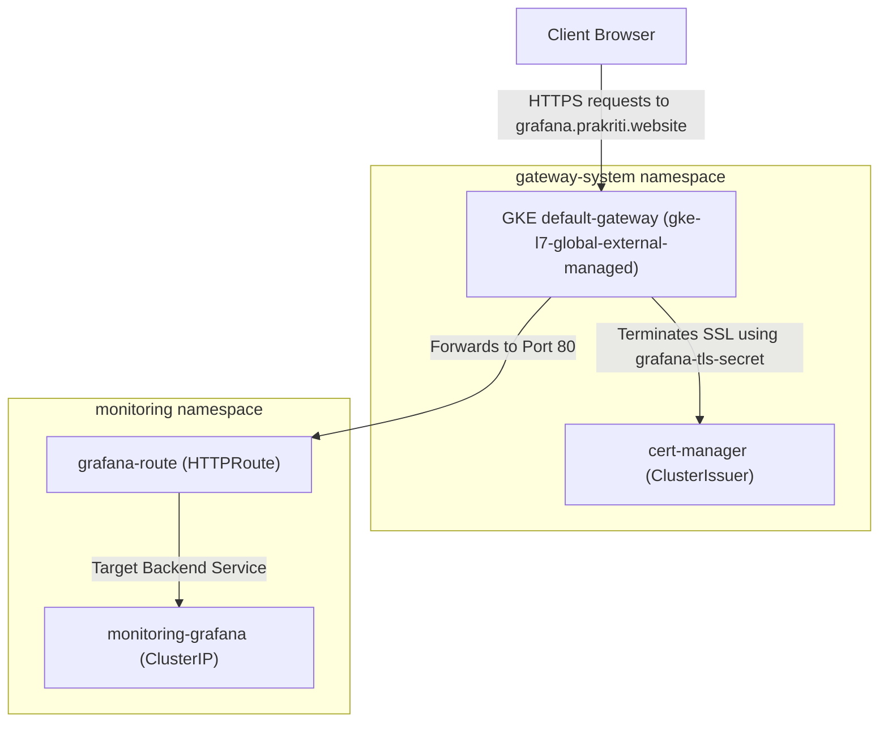
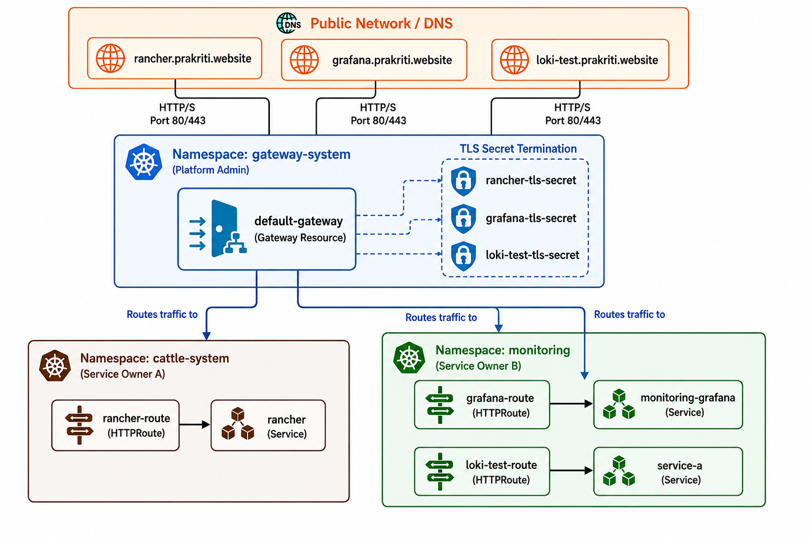

# Shared GKE Gateway Configuration

This directory contains the central, shared **GKE Gateway** infrastructure setup. It manages the external layer-7 HTTP/HTTPS load balancer, SSL/TLS certificates via `cert-manager`, and routing rules for the Grafana monitoring interface.

---

## 📂 File Structure & Purpose

| File Name | Kubernetes Kind | Description |
| :--- | :--- | :--- |
| **[`gateway.yaml`](file:///r:/Devops%20territory/monitoring-ops-stack/gateway/gateway.yaml)** | `Gateway`, `Namespace` | Deploys the `gateway-system` namespace and the `default-gateway`. Configures port `80` (HTTP) and port `443` (HTTPS) listeners with GKE's native `gke-l7-global-external-managed` load balancer class. |
| **[`cluster-issuer.yaml`](file:///r:/Devops%20territory/monitoring-ops-stack/gateway/cluster-issuer.yaml)** | `ClusterIssuer` | Configures `cert-manager` to fetch valid SSL/TLS certificates from Let's Encrypt via DNS-01 or HTTP-01 challenges. |
| **[`grafana-certificate.yaml`](file:///r:/Devops%20territory/monitoring-ops-stack/gateway/grafana-certificate.yaml)** | `Certificate` | Instructs cert-manager to generate an SSL certificate for Grafana and save it as a Kubernetes Secret (`grafana-tls-secret`). |
| **[`grafana-certificate-patch.yaml`](file:///r:/Devops%20territory/monitoring-ops-stack/gateway/grafana-certificate-patch.yaml)** | Kustomize Patch | Patches the certificate template to request TLS for the real domain (`grafana.prakriti.website`). |
| **[`grafana-httproute.yaml`](file:///r:/Devops%20territory/monitoring-ops-stack/gateway/grafana-httproute.yaml)** | `HTTPRoute` | Configures the gateway to forward incoming traffic matching the target host to the `monitoring-grafana` service in the `monitoring` namespace. |
| **[`grafana-route-patch.yaml`](file:///r:/Devops%20territory/monitoring-ops-stack/gateway/grafana-route-patch.yaml)** | Kustomize Patch | Patches the hostname of the HTTPRoute to target the correct external URL: `grafana.prakriti.website`. |
| **[`grafana-healthcheck.yaml`](file:///r:/Devops%20territory/monitoring-ops-stack/gateway/grafana-healthcheck.yaml)** | `HealthCheckPolicy` | GKE-specific policy mapping custom health check intervals and HTTP path probes (`/api/health`) to Grafana's backend pods, preventing false-unhealthy load balancer states. |
| **[`kustomization.yaml`](file:///r:/Devops%20territory/monitoring-ops-stack/gateway/kustomization.yaml)** | `Kustomization` | The parent config that compiles all gateway resources and applies the domain hostname patches. |

---

## 🛠️ Architecture & Routing Details



---

## 📝 Deployment

This directory is consumed as a base resource by the other stack folders (e.g. `metrics/thanos`), but it can be built and deployed independently using Kustomize:

```bash
kubectl kustomize gateway | kubectl apply --server-side --force-conflicts -f -
```

---

## 🖼️ GKE Gateway Status

Below is the visualization of the configured GKE Gateway resource and health check status:



