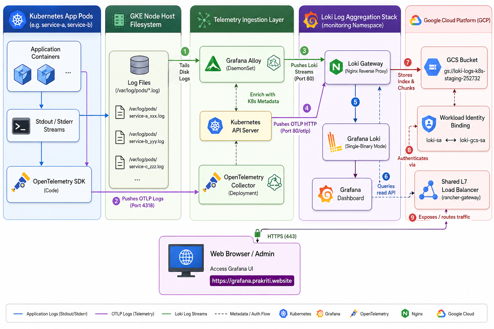

# Grafana Loki & Alloy Log Ingestion Stack on GKE

This directory contains the Helm values, configurations, and step-by-step instructions to deploy a complete, production-ready log aggregation stack on **Google Kubernetes Engine (GKE)** using **Grafana Loki** and **Grafana Alloy** (configured as a DaemonSet for container log collection).

---

## 📊 Architecture Flow



### 🔁 Dual-Path Ingestion Flow

The logging pipeline leverages two parallel, modern ingestion paths:

1. **Host-Level Log Scraping (Grafana Alloy)**:
   - **Log Redirection**: Applications dump stdout/stderr logs, which GKE automatically captures and writes to `/var/log/pods/*.log` on the host node filesystem.
   - **DaemonSet Scraper**: Grafana Alloy runs as a DaemonSet on each node, dynamically tailing all log files and enriching them with Kubernetes metadata labels (pod name, namespace, host).
   - **Gateway Delivery**: Alloy streams the aggregated log blocks directly to the `loki-gateway` service.

2. **Direct Push Logs (OpenTelemetry Collector)**:
   - **OTel Logger Bridge**: Applications send structured, contextual log records directly from memory using the OTel Go Logger SDK.
   - **OTel Collector**: The `opentelemetry-collector` deployment processes the log streams (applying batching, resource detection, and memory limits) and forwards them to the gateway using the native `otlphttp` exporter.

3. **Loki Storage & Authentication**:
   - The **Loki Gateway** acts as the Nginx reverse proxy routing ingest streams.
   - **Grafana Loki** packages chunks and writes them directly to the GCP Cloud Storage bucket (`gs://loki-logs-k8s-staging-252732`).
   - Secure bucket authentication is handled keylessly via **GKE Workload Identity** by binding the Kubernetes service account `loki-sa` to the GCP service account `loki-gcs-sa`.

4. **Visualization**:
   - Grafana pulls queried logs from Loki Gateway.
   - External clients access the dashboards securely at `https://grafana.prakriti.website` routed via SNI on the shared GKE `rancher-gateway` load balancer.

---

## 🛠️ Prerequisites & GCP IAM Setup

To store logs reliably, Loki requires a GCS bucket. We authenticate the Loki pods with the GCS bucket securely using GKE Workload Identity.

### 1. Create the GCS Bucket
Create the GCS bucket with uniform bucket-level access enabled:
```bash
gcloud storage buckets create gs://loki-logs-k8s-staging-252732 --project=k8s-staging-252732 --location=us-central1 --uniform-bucket-level-access
```

### 2. Create the Google Service Account (GSA)
Create the dedicated GSA that Loki will assume to interact with GCS:
```bash
gcloud iam service-accounts create loki-gcs-sa --description="Service account for Grafana Loki to write and read logs from GCS" --display-name="loki-gcs-sa" --project=k8s-staging-252732
```

### 3. Grant GCS Permissions to the GSA
Loki requires two roles bound at the bucket level:
* **Storage Object Admin** (`roles/storage.objectAdmin`): To read/write log chunks and indexes.
* **Storage Legacy Bucket Reader** (`roles/storage.legacyBucketReader`): Required for bucket metadata access.

Run the following commands to bind the roles to the bucket:
```bash
# Grant object-level read/write permissions
gcloud storage buckets add-iam-policy-binding gs://loki-logs-k8s-staging-252732 --member="serviceAccount:loki-gcs-sa@k8s-staging-252732.iam.gserviceaccount.com" --role="roles/storage.objectAdmin"

# Grant bucket-level metadata read permissions
gcloud storage buckets add-iam-policy-binding gs://loki-logs-k8s-staging-252732 --member="serviceAccount:loki-gcs-sa@k8s-staging-252732.iam.gserviceaccount.com" --role="roles/storage.legacyBucketReader"
```

### 4. Bind GSA to GKE Service Account (Workload Identity)
Allow the Kubernetes Service Account `loki-sa` in the `monitoring` namespace to impersonate the Google Service Account using Workload Identity:
```bash
gcloud iam service-accounts add-iam-policy-binding loki-gcs-sa@k8s-staging-252732.iam.gserviceaccount.com --role="roles/iam.workloadIdentityUser" --member="serviceAccount:k8s-staging-252732.svc.id.goog[monitoring/loki-sa]" --project=k8s-staging-252732
```

---

## 🚀 Deployment Steps

Deploy both components into the `monitoring` namespace:

```bash
kubectl create namespace monitoring
```

### 1. Add Helm Repositories
```bash
helm repo add grafana https://grafana.github.io/helm-charts
helm repo update
```

### 2. Deploy Grafana Loki
Apply the config and install Loki (note: `resultsCache` and `chunksCache` are disabled in [loki-values.yaml](file:///r:/Devops%20territory/monitoring-ops-stack/logging/loki/helm-values/loki-values.yaml) to run on resource-constrained clusters):
```bash
helm upgrade --install loki grafana/loki --namespace monitoring --values helm-values/loki-values.yaml --wait
```

### 3. Deploy Grafana Alloy
Deploy Grafana Alloy as a DaemonSet to start tailing node log paths:
```bash
helm upgrade --install alloy grafana/alloy --namespace monitoring --values helm-values/alloy-values.yaml --wait
```

### 4. Deploy the Grafana Stack
Deploy Grafana with only the Loki datasource pre-configured, and exposed via ClusterIP for your GKE Gateway:
```bash
helm upgrade --install monitoring prometheus-community/kube-prometheus-stack --version 72.6.2 --namespace monitoring --values helm-values/prometheus-grafana-stack.yaml --wait
```

### 5. Apply GKE Gateway Manifests

#### 🌐 Shared Gateway Routing Architecture
To implement separation of concerns and reduce ingress resource costs, we deploy a single shared gateway (`default-gateway`) inside a central, platform-admin namespace (`gateway-system`). Application-native HTTPRoutes then reside locally inside their respective workspaces (`monitoring`, `cattle-system`):


Expose Grafana and the Loki Test App externally using the GKE Gateway API:
```bash
# 1. Apply the shared Gateway
kubectl apply -f logging/loki/gateway-routes/gateway.yaml

# 2. Expose Grafana
kubectl apply -f logging/loki/gateway-routes/grafana-certificate.yaml
kubectl apply -f logging/loki/gateway-routes/grafana-httproute.yaml
kubectl apply -f logging/loki/gateway-routes/grafana-healthcheck.yaml

# 3. Expose Loki Test App (Service A)
kubectl apply -f logging/loki/gateway-routes/loki-test-certificate.yaml
kubectl apply -f logging/loki/gateway-routes/loki-test-httproute.yaml
```

---

## 🔍 Verification & Troubleshooting

### 1. Check Pod Statuses
Ensure all components are running correctly:
```bash
kubectl get pods -n monitoring
```

### 2. Check Alloy Pipelines
You can inspect the active pipelines and components in Grafana Alloy's local web console by port-forwarding to it:
```bash
kubectl port-forward svc/alloy 12345:12345 -n monitoring
```
Visit `http://localhost:12345` in your browser. Verify that the `discovery.kubernetes.pods` targets are successfully matched, and `loki.write.loki_endpoint` is sending batches successfully without errors.

### 3. View Logs in Grafana
* Access Grafana using your gateway hostname: `https://grafana.prakriti.website`.
* The datasource for Loki will be automatically added and configured.
* Go to the **Explore** panel, select **Loki** as your datasource, and query your GKE container logs using LogQL (e.g., `{namespace="monitoring"}`).
