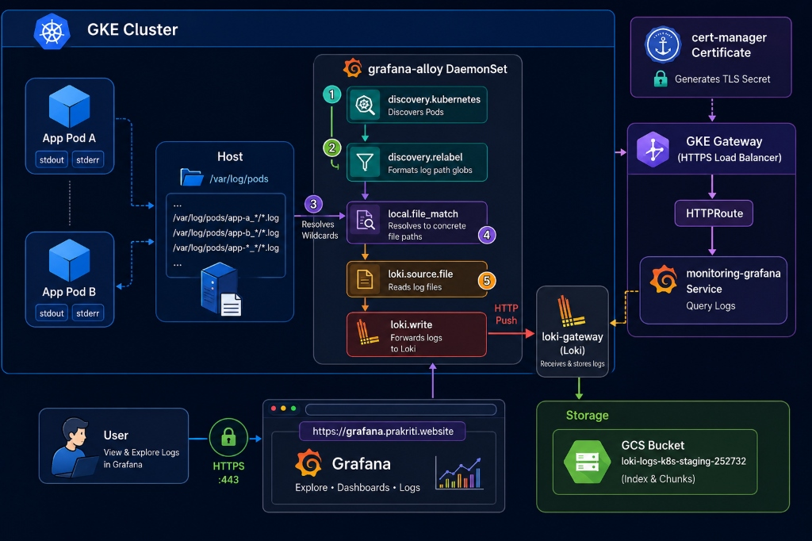

# Grafana Loki & Alloy Log Ingestion Stack on GKE

This directory contains the Helm values, configurations, and step-by-step instructions to deploy a complete, production-ready log aggregation stack on **Google Kubernetes Engine (GKE)** using **Grafana Loki** and **Grafana Alloy** (configured as a DaemonSet for container log collection).

---

## 📊 Architecture Flow

The logging pipeline flows through the components as follows:



1. **Stdout/Stderr Redirection**: GKE container engines stream stdout and stderr outputs of all running pods to files inside the host node directory `/var/log/pods`.
2. **Kubernetes Discovery (`discovery.kubernetes`)**: Grafana Alloy runs as a `DaemonSet` on every GKE node, using the Kubernetes API to discover all running pods on the same host.
3. **Target Relabeling (`discovery.relabel`)**: Converts pod metadata (namespace, name, labels) to log labels and constructs GKE-compatible file path wildcards (e.g. `/var/log/pods/*<pod_uid>/<container_name>/*.log`).
4. **File Match (`local.file_match`)**: Scans the node filesystem to expand wildcards to concrete log file paths (resolving GKE directory-level structure on disk).
5. **Log Tailing & Forwarding (`loki.source.file` & `loki.write`)**: Tails the resolved `.log` files and sends the entries over HTTP to the `loki-gateway` NGINX service on port 80.
6. **Loki Storage**: Grafana Loki stores the indexes and log chunks in your GCP **Google Cloud Storage (GCS)** bucket, authenticating securely via **GKE Workload Identity**.
7. **Visualization**: Grafana queries logs from Loki and exposes them via the **Explore** interface at `https://grafana.prakriti.website`.

---

## 🛠️ Prerequisites & GCP IAM Setup

To store logs reliably, Loki requires a GCS bucket. We authenticate the Loki pods with the GCS bucket securely using GKE Workload Identity.

### 1. Create the GCS Bucket
Create the GCS bucket with uniform bucket-level access enabled:
```bash
gcloud storage buckets create gs://loki-logs-k8s-staging-252732 \
  --project=k8s-staging-252732 \
  --location=us-central1 \
  --uniform-bucket-level-access
```

### 2. Create the Google Service Account (GSA)
Create the dedicated GSA that Loki will assume to interact with GCS:
```bash
gcloud iam service-accounts create loki-gcs-sa \
  --description="Service account for Grafana Loki to write and read logs from GCS" \
  --display-name="loki-gcs-sa" \
  --project=k8s-staging-252732
```

### 3. Grant GCS Permissions to the GSA
Loki requires two roles bound at the bucket level:
* **Storage Object Admin** (`roles/storage.objectAdmin`): To read/write log chunks and indexes.
* **Storage Legacy Bucket Reader** (`roles/storage.legacyBucketReader`): Required for bucket metadata access.

Run the following commands to bind the roles to the bucket:
```bash
# Grant object-level read/write permissions
gcloud storage buckets add-iam-policy-binding gs://loki-logs-k8s-staging-252732 \
  --member="serviceAccount:loki-gcs-sa@k8s-staging-252732.iam.gserviceaccount.com" \
  --role="roles/storage.objectAdmin"

# Grant bucket-level metadata read permissions
gcloud storage buckets add-iam-policy-binding gs://loki-logs-k8s-staging-252732 \
  --member="serviceAccount:loki-gcs-sa@k8s-staging-252732.iam.gserviceaccount.com" \
  --role="roles/storage.legacyBucketReader"
```

### 4. Bind GSA to GKE Service Account (Workload Identity)
Allow the Kubernetes Service Account `loki-sa` in the `monitoring` namespace to impersonate the Google Service Account using Workload Identity:
```bash
gcloud iam service-accounts add-iam-policy-binding loki-gcs-sa@k8s-staging-252732.iam.gserviceaccount.com \
  --role="roles/iam.workloadIdentityUser" \
  --member="serviceAccount:k8s-staging-252732.svc.id.goog[monitoring/loki-sa]" \
  --project=k8s-staging-252732
```

---

## 🚀 Deployment Steps

Deploy both components into the `monitoring` namespace:

```bash
kubectl create namespace monitoring
```

### 1. Add Helm Repositories
```bash
helm repo add grafana https://grafana.github.io/helm-charts
helm repo update
```

### 2. Deploy Grafana Loki
Apply the config and install Loki (note: `resultsCache` and `chunksCache` are disabled in [loki-values.yaml](file:///r:/Devops%20territory/monitoring-ops-stack/logging/loki/helm-values/loki-values.yaml) to run on resource-constrained clusters):
```bash
helm upgrade --install loki grafana/loki \
  --namespace monitoring \
  --values helm-values/loki-values.yaml \
  --wait
```

### 3. Deploy Grafana Alloy
Deploy Grafana Alloy as a DaemonSet to start tailing node log paths:
```bash
helm upgrade --install alloy grafana/alloy \
  --namespace monitoring \
  --values helm-values/alloy-values.yaml \
  --wait
```

### 4. Deploy the Grafana Stack
Deploy Grafana with only the Loki datasource pre-configured, and exposed via ClusterIP for your GKE Gateway:
```bash
helm upgrade --install monitoring prometheus-community/kube-prometheus-stack \
  --version 72.6.2 \
  --namespace monitoring \
  --values helm-values/prometheus-grafana-stack.yaml \
  --wait
```

### 5. Apply GKE Gateway Manifests
Expose Grafana externally at `grafana.prakriti.website` using the GKE Gateway API:
```bash
kubectl apply -f gateway-routes/grafana-gateway.yaml
kubectl apply -f gateway-routes/grafana-certificate.yaml
kubectl apply -f gateway-routes/grafana-httproute.yaml
kubectl apply -f gateway-routes/grafana-healthcheck.yaml
```

---

## 🔍 Verification & Troubleshooting

### 1. Check Pod Statuses
Ensure all components are running correctly:
```bash
kubectl get pods -n monitoring
```

### 2. Check Alloy Pipelines
You can inspect the active pipelines and components in Grafana Alloy's local web console by port-forwarding to it:
```bash
kubectl port-forward svc/alloy 12345:12345 -n monitoring
```
Visit `http://localhost:12345` in your browser. Verify that the `discovery.kubernetes.pods` targets are successfully matched, and `loki.write.loki_endpoint` is sending batches successfully without errors.

### 3. View Logs in Grafana
* Access Grafana using your gateway hostname: `https://grafana.prakriti.website`.
* The datasource for Loki will be automatically added and configured.
* Go to the **Explore** panel, select **Loki** as your datasource, and query your GKE container logs using LogQL (e.g., `{namespace="monitoring"}`).
