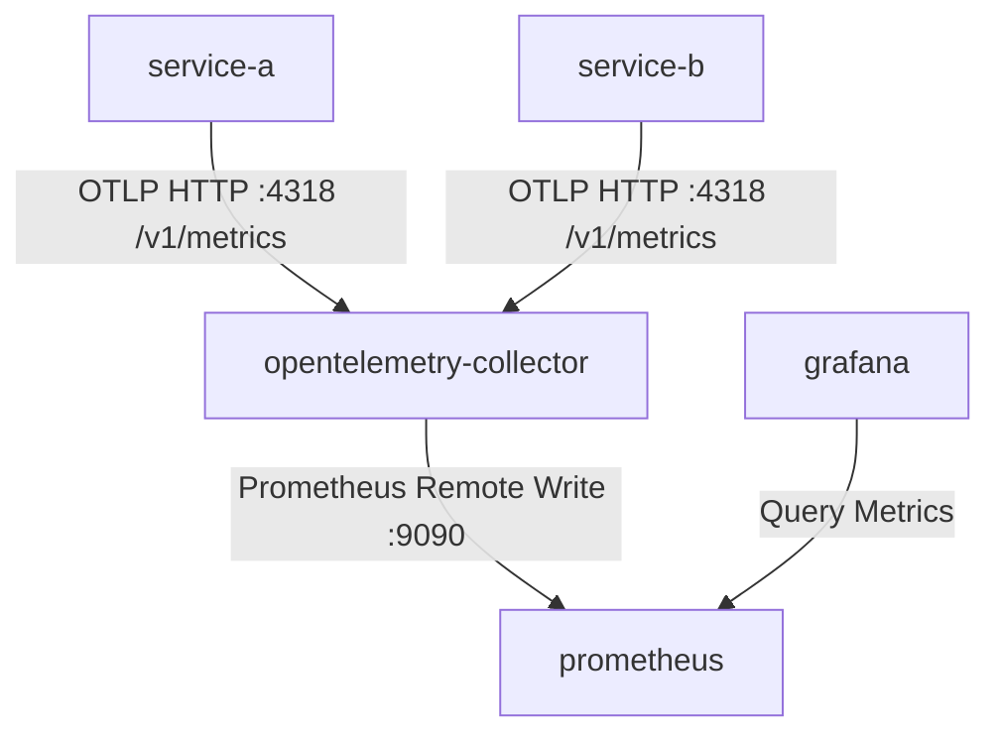

# OpenTelemetry Metrics Pipeline

This directory contains the documentation and references for the OpenTelemetry metrics configuration in the monitoring stack.

## Architecture & Metrics Flow

The metrics generated by the microservices flow through the monitoring pipeline as follows:



1. **Instrumentation**: Both `service-a` and `service-b` are instrumented using the OpenTelemetry Go SDK. They initialize a global `MeterProvider` and record HTTP request count and duration metrics.
2. **Collection**: The OpenTelemetry Collector receives the metrics over OTLP/HTTP.
3. **Export**: The Collector uses the `prometheusremotewrite` exporter to forward the metrics directly to the Prometheus server remote write receiver.
4. **Visualization**: Grafana queries Prometheus to visualize the metrics.

---

## Metrics Generated

The services generate the following standard metrics:

### 1. `http_requests_total`
- **Type**: Counter
- **Description**: Total number of HTTP requests received by the service.
- **Labels**:
  - `http.method`: HTTP method (e.g., `GET`, `POST`)
  - `http.route`: Route path matched (e.g., `/`, `/api/hello`, `/process`)
  - `http.status_code`: HTTP status code returned (e.g., `200`, `404`, `500`)

### 2. `http_request_duration_seconds`
- **Type**: Histogram
- **Description**: Duration of HTTP requests in seconds.
- **Labels**:
  - `http.method`: HTTP method
  - `http.route`: Route path matched
  - `http.status_code`: HTTP status code returned

---

## Deployment & Verification

### 1. Upgrade the OpenTelemetry Collector
Apply the updated collector configurations using Helm:
```bash
helm upgrade opentelemetry-collector open-telemetry/opentelemetry-collector \
  --namespace monitoring \
  --values tracing/tempo-opentelemetry/helm/otel-collector-values.yaml
```

### 2. Build and Deploy the Services
Rebuild the docker images for `service-a` and `service-b` to include the metrics instrumentation, push them to the registry, and apply the Kubernetes manifests:
```bash
# Apply updated manifests
kubectl apply -f test/k8s-manifests.yaml
```

### 3. Verify Metrics in Grafana Explore
1. Log in to Grafana.
2. Go to **Explore** and select the **Prometheus** (or **monitoring-kube-prometheus**) datasource.
3. Search for:
   ```promql
   http_requests_total
   ```
   Or query latency:
   ```promql
   rate(http_request_duration_seconds_sum[5m]) / rate(http_request_duration_seconds_count[5m])
   ```
