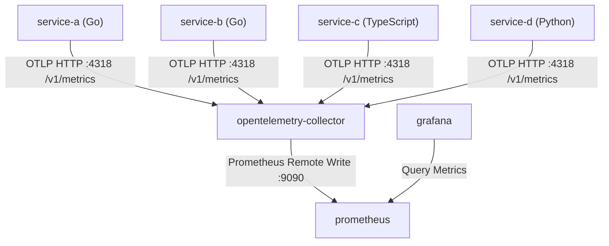
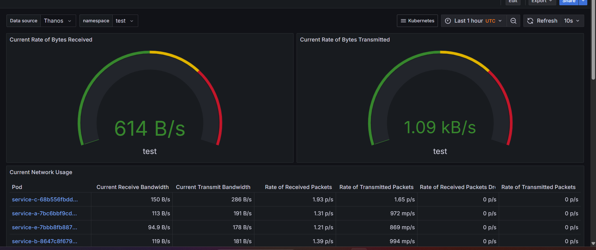

# OpenTelemetry Metrics Pipeline

This directory contains the documentation and references for the OpenTelemetry metrics configuration in the monitoring stack.

## Architecture & Metrics Flow

The metrics generated by the microservices flow through the monitoring pipeline as follows:



1. **Instrumentation**: Microservices (`service-a`, `service-b`, `service-c`, and `service-d`) are instrumented using their respective OpenTelemetry SDKs. They initialize a global `MeterProvider` and record HTTP request counts and durations.
2. **Collection**: The OpenTelemetry Collector receives the metrics over OTLP/HTTP.
3. **Export**: The Collector uses the `prometheusremotewrite` exporter to forward the metrics directly to the Prometheus server's remote write receiver.
4. **Visualization**: Grafana and Prometheus query the metrics.

---

## Kustomize Project Structure

To decouple environmental properties and avoid strategic merge conflicts, the metrics deployments are structured as follows:

```text
repo-root/
├── gateway/                           # Shared GKE Gateway sub-kustomization
│   ├── kustomization.yaml             # Base gateway kustomization
│   ├── gateway.yaml                   # Shared GKE Gateway definition
│   ├── cluster-issuer.yaml            # cert-manager ClusterIssuer configuration
│   ├── grafana-certificate.yaml       # Certificate template for Grafana
│   ├── grafana-httproute.yaml         # HTTPRoute for Grafana
│   └── grafana-healthcheck.yaml       # GKE HealthCheckPolicy for Grafana
└── metrics/
    ├── kustomization.yaml             # Parent entrypoint (deploys Helm charts & resources)
    ├── community/                     # Prometheus-only metrics config (no Thanos)
    │   ├── kustomization.yaml
    │   ├── prometheus-grafana-stack.yaml
    │   └── gateway-components/
    │       ├── kustomization.yaml
    │       ├── prometheus-certificate.yaml
    │       ├── prometheus-httproute.yaml
    │       ├── prometheus-healthcheck.yaml
    │       └── prometheus-gateway-patch.yaml
    └── thanos/                        # Thanos pipeline config
        ├── kustomization.yaml
        ├── prometheus-grafana-stack.yaml
        ├── thanos-values.yaml
        ├── thanos-objstore.yaml
        └── gateway-components/
            ├── kustomization.yaml
            ├── thanos-certificate.yaml
            ├── thanos-httproute.yaml
            ├── thanos-healthcheck.yaml
            └── thanos-gateway-patch.yaml
```

### Key Design Decisions:
1. **Isolated Sub-Kustomizations**: By encapsulating the shared base GKE Gateway definition inside the root `/gateway` directory and utilizing local `gateway-components` sub-kustomizations to append configuration, we avoid duplication and strategic merge conflicts.
2. **Coexistence-Safe Gateway Patching**: GKE Custom Resource list fields (like `certificateRefs` under `Gateway`) are treated as replace-by-default lists. To prevent separate pipelines from overwriting one another's certificates, the patch files utilize `op: add` to append individual certificate references (such as `prometheus-tls-secret` or `thanos-tls-secret`), ensuring all subdomains are kept active.
3. **Declarative Helm Chart Generation**: Instead of installing or upgrading resources manually via the `helm` CLI, the parent `kustomization.yaml` declares the `kube-prometheus-stack` chart inline via the `helmCharts` field. Running kustomize with the `--enable-helm` flag fetches, templates, and builds the chart. This provides a fully declarative GitOps pipeline for community charts.

---

## Metrics Generated

The services generate the following standard metrics:

### 1. `http_requests_total`
- **Type**: Counter
- **Description**: Total number of HTTP requests received by the service.
- **Labels (Sanitized in Prometheus)**:
  - `http_method`: HTTP method (e.g., `GET`, `POST`) [originally `http.method`]
  - `http_route`: Route path matched (e.g., `/`, `/api/hello`, `/call-grpc`) [originally `http.route`]
  - `http_status_code`: HTTP status code returned (e.g., `200`, `404`, `500`) [originally `http.status_code`]

> [!NOTE]
> **OpenTelemetry Label Sanitization**: OpenTelemetry attribute names use dot-notation (like `http.route`). When exported to Prometheus, dots (`.`) are automatically replaced with underscores (`_`) to comply with Prometheus naming conventions. Always query using `http_route`, `http_method`, and `http_status_code`.

### 2. `http_request_duration_seconds`
- **Type**: Histogram
- **Description**: Duration of HTTP requests in seconds.
- **Labels**:
  - `http_method`: HTTP method
  - `http_route`: Route path matched
  - `http_status_code`: HTTP status code returned

---

## External Access via GKE Gateway

Prometheus is exposed externally under the GKE Gateway load balancer:
* **Host**: `http://prometheus.prakriti.website/` (TLS Certificate: `prometheus-tls-secret`)
* **Health Check Probe**: Handled via GKE's `HealthCheckPolicy` targeting the `/-/healthy` path. This is required because Prometheus returns a `302` redirect on `/` (which GKE's default health checker flags as unhealthy), whereas `/-/healthy` returns a flat `200 OK`.

---

## Deployment & Verification

### 1. Deploy/Update the Metrics Stack
To compile the metrics configuration manifests and apply the shared GKE Gateway patches:
```bash
kubectl kustomize metrics --enable-helm | kubectl apply --server-side --force-conflicts -f -
```

### 2. Deploy/Update the Prometheus Health Check Policy
To apply the custom health check policy directly:
```bash
kubectl apply -f metrics/gateway/prometheus-healthcheck.yaml
```

### 3. Verify Ingress & Routing Status
Verify that the `default-gateway` has successfully reconciled and bound the HTTPRoute:
```bash
kubectl describe gateway default-gateway -n gateway-system
```

Verify that the Prometheus route matches and routes traffic successfully:
```bash
kubectl describe httproute prometheus-route -n monitoring
```

---

## Example PromQL Queries

You can execute these queries in Grafana Explore or directly in the Prometheus UI:

### 1. Rate of requests grouped by HTTP method:
```promql
sum by (http_method) (rate(http_requests_total[5m]))
```

### 2. Average Latency (in seconds) per route:
```promql
sum by (http_route) (rate(http_request_duration_seconds_sum[5m])) 
/ 
sum by (http_route) (rate(http_request_duration_seconds_count[5m]))
```

### 3. 95th Percentile Latency (in seconds) per service:
```promql
histogram_quantile(0.95, sum by (le, job) (rate(http_request_duration_seconds_bucket[5m])))
```

### 4. Request count for a specific route:
```promql
avg_over_time(http_requests_total{http_route="/"}[2m])
```

### 5. Grouping failures (5xx status codes) by service:
```promql
sum by (service_name) (rate(http_requests_total{http_status_code=~"5.."}[5m]))
```

---

## Namespace Pod & Network Resource Utilization

Below is a visualization of the Grafana dashboard showing the pod network utilization and resource consumption inside the `test` namespace, querying through Thanos:



