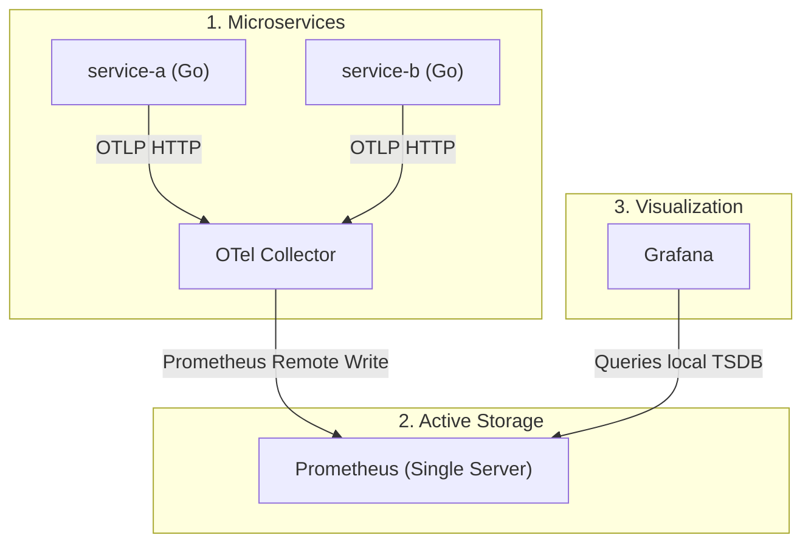
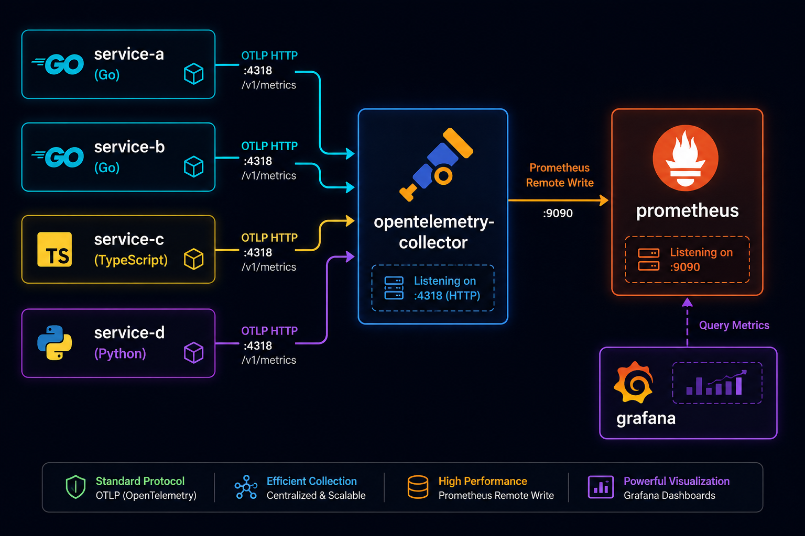

# Community Metrics Tools Deployment

This directory contains the configurations and deployment steps for the **Community-based Prometheus & Grafana stack** (without Thanos). It is ideal for local development, staging environments, or lightweight monitoring setups that do not require long-term metrics persistence in object storage.

---

## 📊 Telemetry Flow & Architecture

In the standard community stack, metrics are collected directly on the Prometheus server's local disk (TSDB):



---

## 🛠️ Components List

1. **Prometheus Operator**: Manages a standard Prometheus server configured with:
   * `enableRemoteWriteReceiver: true` to collect microservices' metrics directly from the OTel Collector.
   * Scrape targets for **Kube State Metrics** and **Node Exporter**.
2. **Grafana**: Provides centralized dashboards. Since Thanos is not present, Grafana queries the local Prometheus service (`http://monitoring-kube-prometheus-prometheus.monitoring:9090`) directly as the default datasource.
3. **GKE Gateway Ingress Route**: Maps routing endpoints via GKE Gateway API:
   * Hostname: `prometheus.prakriti.website`
   * Health probes pointing to `/-/healthy` (flat `200 OK` endpoint).

---

## 🖼️ Community Dashboard Visualization

Below is the visualization of the Grafana metrics dashboard querying node and container statistics from the community Prometheus instance:



---

## 📝 Deployment Commands

To deploy this community stack independently:

1. Enable the community resource directory and values file in the parent **[`metrics/kustomization.yaml`](file:///r:/Devops%20territory/monitoring-ops-stack/metrics/kustomization.yaml)**:
   ```yaml
   resources:
     - community
     # - thanos

   helmCharts:
     - name: kube-prometheus-stack
       ...
       valuesFile: community/prometheus-grafana-stack.yaml
   ```

2. Compile and apply the manifests:
   ```bash
   kubectl kustomize metrics --enable-helm | kubectl apply --server-side --force-conflicts -f -
   ```
