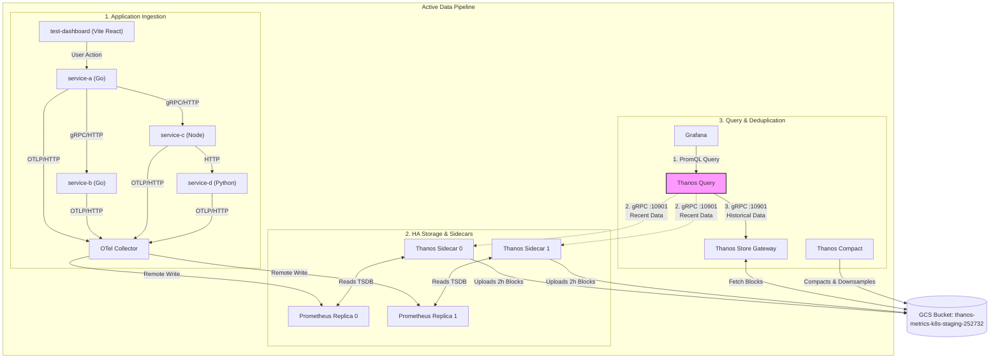
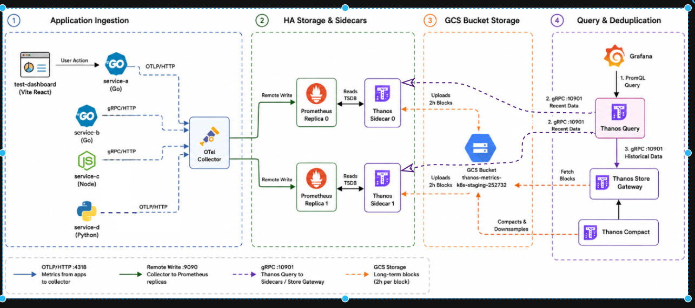

# Thanos Storage & Query Pipeline

This directory contains the configurations and documentation for integrating Thanos into the metrics stack. Thanos provides global query aggregation, historical block retrieval, and compact/retention capabilities for long-term metric storage.

## Architecture

The following diagram illustrates the end-to-end metrics ingestion and query path, placing the GCS bucket as a shared storage tier at the bottom to represent query flows accurately without boundary crossing issues:




> [!NOTE]
> **Deduplication**: When **Thanos Query** receives a request from **Grafana**, it queries both Thanos Sidecars (for the latest metrics in the last 2 hours) and the Store Gateway (for old historical data). It then deduplicates the time-series on the fly based on the `prometheus_replica` label before returning the aggregated results to Grafana.


---

## Object Storage Configuration (GCS)

To configure connection access to the Google Cloud Storage bucket, the local file `thanos-objstore.yaml` is compiled into a Kubernetes Secret (`thanos-objstore-secret`) by Kustomize.

### Workload Identity Configuration (Best Practice / No JSON Keys)
By utilizing **GKE Workload Identity**, we avoid generating and storing static GCP service account JSON key files on disk. The Google Cloud Client Library automatically uses **Application Default Credentials (ADC)** provided dynamically by GKE metadata server to authenticate.

Simplify your `thanos-objstore.yaml` to only reference the target GCS bucket name:
```yaml
type: GCS
config:
  bucket: thanos-metrics-k8s-staging-252732
```

---

## Setting up Thanos Object Storage and Workload Identity (GCP CLI)

Before binding the service accounts, make sure the GCS bucket and the Google Service Account (GSA) are created with the correct permissions.

### Step 1: Create the GCS Bucket
Create the GCS bucket with uniform bucket-level access enabled:
```bash
gcloud storage buckets create gs://thanos-metrics-k8s-staging-252732 --project=k8s-staging-252732 --location=us-central1 --uniform-bucket-level-access
```

### Step 2: Create the Google Service Account (GSA)
Create the dedicated GSA that Thanos will assume:
```bash
gcloud iam service-accounts create thanos-gcs-sa --description="Service account for Thanos to access GCS" --display-name="thanos-gcs-sa" --project=k8s-staging-252732
```

### Step 3: Grant GCS Permissions to the GSA
Thanos requires the following roles bound at the bucket level:
* **Storage Object Admin** (`roles/storage.objectAdmin`): To read, write, and delete metric blocks.
* **Storage Legacy Bucket Reader** (`roles/storage.legacyBucketReader`): Required for bucket metadata access.

```bash
gcloud storage buckets add-iam-policy-binding gs://thanos-metrics-k8s-staging-252732 --member="serviceAccount:thanos-gcs-sa@k8s-staging-252732.iam.gserviceaccount.com" --role="roles/storage.objectAdmin"
gcloud storage buckets add-iam-policy-binding gs://thanos-metrics-k8s-staging-252732 --member="serviceAccount:thanos-gcs-sa@k8s-staging-252732.iam.gserviceaccount.com" --role="roles/storage.legacyBucketReader"
```

### Step 4: Bind the Prometheus Pod Service Account (Sidecar Uploads)
The Prometheus pods use the service account `prometheus-k8s` in the namespace `monitoring`:
```bash
gcloud iam service-accounts add-iam-policy-binding thanos-gcs-sa@k8s-staging-252732.iam.gserviceaccount.com --role="roles/iam.workloadIdentityUser" --member="serviceAccount:k8s-staging-252732.svc.id.goog[monitoring/prometheus-k8s]"
```

### Step 5: Bind the Thanos Store Gateway Service Account (Historical Queries)
The Store Gateway pods use the service account `thanos-storegateway` in the namespace `monitoring`:
```bash
gcloud iam service-accounts add-iam-policy-binding thanos-gcs-sa@k8s-staging-252732.iam.gserviceaccount.com --role="roles/iam.workloadIdentityUser" --member="serviceAccount:k8s-staging-252732.svc.id.goog[monitoring/thanos-storegateway]"
```

### Step 6: Annotate Service Accounts in Helm values
Add the GCP service account mapping annotations directly to the respective Helm values:

#### In `metrics/helm-values/prometheus-grafana-stack.yaml`:
```yaml
prometheus:
  prometheusSpec:
    serviceAccountName: prometheus-k8s
  serviceAccount:
    annotations:
      iam.gke.io/gcp-service-account: "thanos-gcs-sa@k8s-staging-252732.iam.gserviceaccount.com"
```

#### In `metrics/thanos/thanos-values.yaml`:
```yaml
storegateway:
  enabled: true
  serviceAccount:
    annotations:
      iam.gke.io/gcp-service-account: "thanos-gcs-sa@k8s-staging-252732.iam.gserviceaccount.com"
```

---

## Deployment & Verification

Deploy the entire metrics and Thanos pipeline from the repository root:
```bash
kubectl kustomize metrics --enable-helm | kubectl apply --server-side --force-conflicts -f -
```

Check the Thanos Sidecar status inside the Prometheus pod:
```bash
kubectl describe pod prometheus-monitoring-kube-prometheus-prometheus-0 -n monitoring
```

Check Thanos Query service status:
```bash
kubectl get svc -n monitoring -l "app.kubernetes.io/name=thanos"
```

---

## Thanos & Grafana Metrics Dashboard

Below is a visualization of the Grafana dashboard querying metrics through Thanos Query:



