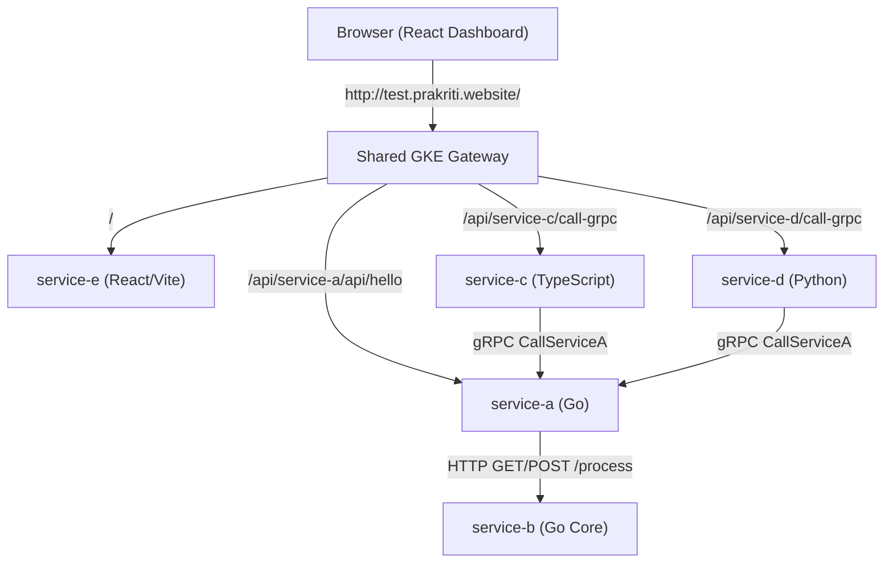

# Interconnected Multi-Service Testbed (service-a to service-e)

This directory contains a containerized microservices application designed to demonstrate logging, tracing, metrics flow, and request correlation in the Kubernetes monitoring stack.

## Architecture & Request Flows

The microservices stack consists of 5 services written in different programming languages:



### Supported Flow Pipelines:
1. **HTTP Pipeline (`Service A ➔ Service B`)**: 
   A client calls Service A's HTTP endpoint. Service A automatically generates/propagates a `correlation_id` in headers and forwards the HTTP request to Service B.
2. **TypeScript gRPC Link (`Service C ➔ Service A ➔ Service B`)**:
   A client calls Service C's Express endpoints. Service C translates this into a gRPC request (`CallServiceA`) to Service A, which in turn calls Service B via gRPC (`CallServiceB`).
3. **Python gRPC Link (`Service D ➔ Service A ➔ Service B`)**:
   A client calls Service D's Flask endpoints. Service D translates this into a gRPC request (`CallServiceA`) to Service A, which calls Service B via gRPC.

All services are fully instrumented with **OpenTelemetry** and stream metrics/logs over OTLP to the OpenTelemetry Collector.

---

## Ingress Routing & GKE Gateway Setup

External ingress is configured via GKE's Gateway Controller using path-prefix routing and the native `URLRewrite` filter:
* **Domain Name**: `test.prakriti.website` (managed via `loki-test-tls-secret`).
* **Path Mappings**:
  * `/` ➔ `service-e` (React dashboard)
  * `/api/service-a/*` ➔ Strips `/api/service-a` ➔ `service-a` (Port 8080)
  * `/api/service-b/*` ➔ Strips `/api/service-b` ➔ `service-b` (Port 8081)
  * `/api/service-c/*` ➔ Strips `/api/service-c` ➔ `service-c` (Port 8082)
  * `/api/service-d/*` ➔ Strips `/api/service-d` ➔ `service-d` (Port 8083)

This routing setup eliminates CORS issues, permitting the React SPA running in the client's browser to make seamless Ajax calls to `${window.location.origin}/api/service-*`.

---

## 1. Local Testing & Development Commands

### Run Services Locally

You can run these applications locally to verify logging formats and standard behavior.

#### Run Service B (Go Core)
```bash
cd test/service-b
$env:OTEL_EXPORTER_OTLP_ENDPOINT="localhost:4318"
go run main.go
```
*Starts on port `8081`.*

#### Run Service A (Go Gateway)
```bash
cd test/service-a
$env:SERVICE_B_URL="http://localhost:8081/process"
$env:SERVICE_B_GRPC_URL="localhost:50052"
$env:OTEL_EXPORTER_OTLP_ENDPOINT="localhost:4318"
go run main.go
```
*Starts on port `8080` (HTTP) and `50051` (gRPC).*

#### Run Service C (Node / TypeScript)
```bash
cd test/service-c
npm install
$env:SERVICE_A_GRPC_URL="localhost:50051"
$env:OTEL_EXPORTER_OTLP_ENDPOINT="localhost:4318"
npm start
```
*Starts on port `8082`.*

#### Run Service D (Python / Flask)
```bash
cd test/service-d
pip install -r requirements.txt
$env:SERVICE_A_GRPC_URL="localhost:50051"
$env:OTEL_EXPORTER_OTLP_ENDPOINT="localhost:4318"
python main.py
```
*Starts on port `8083`.*

#### Run Service E (React Dashboard Frontend)
```bash
cd test/service-e
npm install
npm run dev
```
*Starts on port `5173`.*

---

## 2. Deploying to Kubernetes

All test applications are deployed under the `test` namespace.

### Build & Deploy Commands
Apply the test suite manifests (which compile the local Helm charts for all 5 services):
```bash
# Apply kustomization (compile helm chart and shared gateway definitions)
kubectl kustomize test/kustomize | kubectl apply --server-side --force-conflicts -f -
```

### Rollout Update after Rebuild
If you push changes to `test/`, a GitHub Actions workflow (`.github/workflows/loki-test-apps.yaml`) automatically builds and pushes the updated Docker images via Workload Identity Federation (WIF). 
Once the build completes, restart the pods to pull the new code:
```bash
kubectl rollout restart deployment -n test --all
```

---

## 3. Telemetry Architecture: Logs & Metrics

The microservices stack is fully integrated with OpenTelemetry to output structured telemetry data (Logs and Metrics) for real-time observability.

### A. Metrics Stack
Metrics allow you to monitor the health, throughput, and performance of the applications.

* **Metric Definitions**:
  * **`http_requests_total`** (Counter): Tracks the total count of incoming HTTP requests.
  * **`http_request_duration_seconds`** (Histogram): Measures request processing latency.
* **Instrumentation & Flow**:
  1. Each microservice records metrics using native OpenTelemetry Meter APIs.
  2. The metrics are pushed over **OTLP/HTTP** (on port `4318` via path `/v1/metrics`) to the centralized **OpenTelemetry Collector**.
  3. The Collector aggregates these metrics and writes them to the Prometheus server using the **Prometheus Remote Write** protocol (`prometheusremotewrite` exporter targeting port `9090`).
* **Prometheus Sanitization Rules**:
  * Prometheus does not support dot-separated label names. During the export process, OpenTelemetry labels (like `http.route` or `http.method`) are converted into underscore-separated formats:
    * `http.method` ➔ `http_method`
    * `http.route` ➔ `http_route`
    * `http.status_code` ➔ `http_status_code`

---

### B. Logs Stack
Logs provide a granular text-based record of execution events inside the microservices.

* **Structured Logging**:
  * **Go Services (`service-a`, `service-b`)**: Use Go's built-in `log/slog` structured logger to emit logs in JSON format directly to stdout.
  * **TypeScript/Python Services (`service-c`, `service-d`)**: Write structured metadata (like method, path, status, and latency) to standard output.
* **Request Correlation (Tracing Logs)**:
  * To trace requests spanning multiple microservices, the application uses **Request Correlation**.
  * When a request enters `service-a`, it extracts or generates a unique `X-Correlation-Id` header (e.g. `8c414995f5195cc4b...`).
  * As the request moves downstream (via HTTP or gRPC), this ID is passed along in headers.
  * Every service log entry includes a `"correlation_id"` field. Searching Loki for this single ID yields the exact chronological execution path across all microservices.
* **Collection Flow**:
  * The stdout/stderr logs of the containers are collected by the logging daemon (like Promtail or OTel Collector's Loki exporter) and forwarded directly to **Grafana Loki**.

---

### C. Microservice SDK Instrumentations (Code Implementation)

Here are the exact code implementation structures used to bootstrap the OpenTelemetry metrics collection in each microservice:

#### 1. Go SDK (`service-a`, `service-b`)
We wrap standard HTTP handler functions using custom Go middleware that initializes the `http_requests_total` counter and `http_request_duration_seconds` histogram metrics:
```go
func instrumentHandler(meter metric.Meter, next http.HandlerFunc, path string) http.HandlerFunc {
	requestCounter, _ := meter.Int64Counter("http_requests_total",
		metric.WithDescription("Total number of HTTP requests received"),
		metric.WithUnit("1"),
	)
	requestDuration, _ := meter.Float64Histogram("http_request_duration_seconds",
		metric.WithDescription("Duration of HTTP requests in seconds"),
		metric.WithUnit("s"),
	)

	return func(w http.ResponseWriter, r *http.Request) {
		start := time.Now()
		rw := &responseWriterWrapper{ResponseWriter: w, statusCode: http.StatusOK}

		next(rw, r) // Execute inner handler logic

		duration := time.Since(start).Seconds()
		attrs := []attribute.KeyValue{
			attribute.String("http.method", r.Method),
			attribute.String("http.route", path),
			attribute.Int("http.status_code", rw.statusCode),
		}

		requestCounter.Add(r.Context(), 1, metric.WithAttributes(attrs...))
		requestDuration.Record(r.Context(), duration, metric.WithAttributes(attrs...))
	}
}
```

#### 2. Express / Node.js SDK (`service-c`)
In Node.js, we configure Express to use custom metrics middleware, intercepting the response's `finish` event to capture execution latency:
```typescript
app.use((req, res, next) => {
  const start = Date.now();
  res.on('finish', () => {
    const duration = (Date.now() - start) / 1000;
    const route = req.route ? req.route.path : req.path;
    if (requestCounter) {
      requestCounter.add(1, {
        'http.method': req.method,
        'http.route': route,
        'http.status_code': res.statusCode.toString(),
      });
    }
    if (requestDuration) {
      requestDuration.record(duration, {
        'http.method': req.method,
        'http.route': route,
        'http.status_code': res.statusCode.toString(),
      });
    }
  });
  next();
});
```

#### 3. Flask / Python SDK (`service-d`)
For Python, we utilize Flask's native `@app.before_request` and `@app.after_request` request lifecycle hooks to compute runtime metrics:
```python
@app.before_request
def handle_options_and_timer():
    request.start_time = time.time()

@app.after_request
def record_metrics(response):
    if request.method != 'OPTIONS' and request_counter and hasattr(request, "start_time"):
        duration = time.time() - request.start_time
        route = request.url_rule.rule if request.url_rule else request.path
        
        labels = {
            "http.method": request.method,
            "http.route": route,
            "http.status_code": str(response.status_code)
        }
        request_counter.add(1, labels)
        request_duration.record(duration, labels)
    return response
```

---

## 4. Querying Telemetry in Grafana

Open Grafana and go to the **Explore** tab.

### Trace Request Lifecycles in Loki (Logs)
Grab the **Correlation ID** printed in the React Dashboard's terminal console and run this LogQL query:
```logql
{container=~"service-.*"} | json | correlation_id="<YOUR-CORRELATION-ID-HERE>"
```
This lists the chronological trace of logs from all services involved in that request.

### Monitor Traffic in Prometheus (Metrics)
Find request rates grouped by HTTP method:
```promql
sum by (http_method) (rate(http_requests_total[5m]))
```

View average latencies by route:
```promql
sum by (http_route) (rate(http_request_duration_seconds_sum[5m])) 
/ 
sum by (http_route) (rate(http_request_duration_seconds_count[5m]))
```

View the 95th percentile latency per service:
```promql
histogram_quantile(0.95, sum by (le, job) (rate(http_request_duration_seconds_bucket[5m])))
```

View the 95th percentile latency per route:
```promql
histogram_quantile(0.95, sum by (le, http_route) (rate(http_request_duration_seconds_bucket[5m])))
```
*(Note: OpenTelemetry attributes with dots like `http.method` and `http.route` are sanitized to `http_method` and `http_route` in Prometheus.)*
