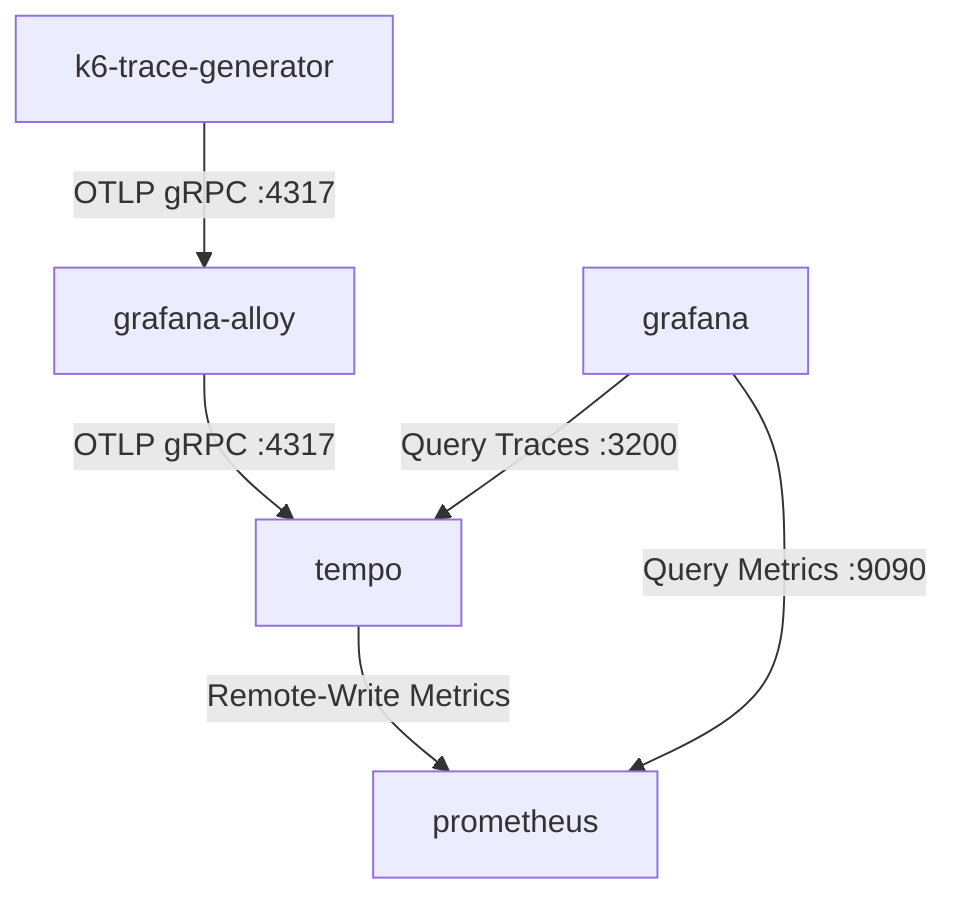

# Grafana Alloy & Tempo Tracing Stack

This directory contains the Helm values, Kubernetes manifests, and Terraform files to deploy a complete distributed tracing stack on Google Kubernetes Engine (GKE) using **Grafana Tempo**, **Grafana Alloy** (configured as an OTLP pipeline agent via River), **Prometheus/Grafana Stack**, and a synthetic **k6 Trace Generator**.

---

## Architecture Flow

The telemetry data and metrics flow through the system as follows:



1. **Trace Generation**: The `k6-trace-generator` pod creates synthetic traces and sends them to the Grafana Alloy OTLP endpoint.
2. **Pipeline Processing**: **Grafana Alloy** acts as the ingestion pipeline. It receives traces via OTLP, processes them, and exports them to **Grafana Tempo**.
3. **Storage & Metrics Generation**:
   * **Traces**: Grafana Tempo stores the raw traces.
   * **Metrics**: Tempo's internal **Metrics Generator** processes incoming spans to compute **Service Graphs** and **Span Metrics**, which it remote-writes directly to Prometheus.
4. **Visualization**: Grafana queries traces from Tempo and service graph metrics from Prometheus to render Explore Traces and Service Graph visualisations.

---

## Configuration Reference

### 1. Grafana Alloy Pipeline (`helm-values/alloy-values.yaml`)
Alloy uses the declarative **River** configuration language to define data pipelines. The configuration exposes OTLP receivers and forwards traces to Tempo:
```river
// OTLP receiver configuration
otelcol.receiver.otlp "otlp_receiver" {
  grpc {
    endpoint = "0.0.0.0:4317"
  }
  http {
    endpoint = "0.0.0.0:4318"
  }
  output {
    traces = [otelcol.exporter.otlp.tempo.input]
  }
}

// OTLP exporter to Tempo
otelcol.exporter.otlp "tempo" {
  client {
    endpoint = "tempo:4317"
    tls {
      insecure = true
    }
  }
}
```

### 2. Tempo Configuration (`helm-values/tempo-values.yaml`)
To generate service graphs and span metrics, `metricsGenerator` is enabled and configured with a remote-write endpoint targeting the Prometheus server:
```yaml
tempo:
  metricsGenerator:
    enabled: true
    remoteWriteUrl: "http://monitoring-kube-prometheus-prometheus:9090/api/v1/write"
      
  overrides:
    defaults:
      metrics_generator:
        processors: [service-graphs, span-metrics, local-blocks]
```

---

## Deployment Options

### Option A: Deployment via Terraform
A Terraform configuration is provided in `tf-alloy-tempo` to provision the entire stack.

1. **Initialise and apply the configuration**:
   ```bash
   cd tf-alloy-tempo
   terraform init
   terraform apply
   ```
   This will automatically:
   * Create the `monitoring` namespace.
   * Deploy the Kube-Prometheus stack.
   * Deploy Grafana Tempo.
   * Deploy Grafana Alloy.

2. **Deploy the trace generator**:
   ```bash
   kubectl apply -f ../trace-generator.yaml
   ```

---

### Option B: Manual Deployment via Helm

1. **Create Namespace & Register Helm Repositories**:
   ```bash
   kubectl create namespace monitoring
   helm repo add grafana https://grafana.github.io/helm-charts
   helm repo add grafana-community https://grafana-community.github.io/helm-charts
   helm repo add prometheus-community https://prometheus-community.github.io/helm-charts
   helm repo update
   ```

2. **Deploy Prometheus + Grafana**:
   ```bash
   helm install monitoring prometheus-community/kube-prometheus-stack \
     --version 72.6.2 \
     --namespace monitoring \
     --values helm-values/prometheus-grafana-stack.yaml \
     --wait
   ```

3. **Deploy Tempo**:
   ```bash
   helm install tempo grafana-community/tempo \
     --version 1.21.1 \
     --namespace monitoring \
     --values helm-values/tempo-values.yaml \
     --wait
   ```

4. **Deploy Grafana Alloy**:
   ```bash
   helm install alloy grafana/alloy \
     --version 1.0.3 \
     --namespace monitoring \
     --values helm-values/alloy-values.yaml \
     --wait
   ```

5. **Deploy the Trace Generator**:
   ```bash
   kubectl apply -f trace-generator.yaml
   ```

---

## Verification & Troubleshooting

### 1. Check Pod Statuses
Ensure all components are running in the `monitoring` namespace:
```bash
kubectl get pods -n monitoring
```

### 2. Check Alloy Configuration Status
Grafana Alloy hosts a local UI showing the state of active River components and pipeline graphs. You can port-forward to inspect it:
```bash
kubectl port-forward svc/alloy 12345:12345 -n monitoring
```
Visit `http://localhost:12345` in your browser to inspect the OTLP receiver and OTLP exporter targets.

### 3. Visualise in Grafana
* Access the Grafana external load balancer URL (e.g. `http://<grafana-loadbalancer-ip>`).
* Navigate to **Explore** and select the **Tempo** datasource.
* Use **TraceQL** or the **Search** tab to query traces.
* **Troubleshooting Note**: Depending on the specific chart version or service mapping, you may need to update the Tempo datasource HTTP URL in [prometheus-grafana-stack.yaml](helm-values/prometheus-grafana-stack.yaml) to use port `3200` (Tempo's HTTP Query API port) instead of `3100`:
  ```yaml
  url: http://tempo:3200
  ```
