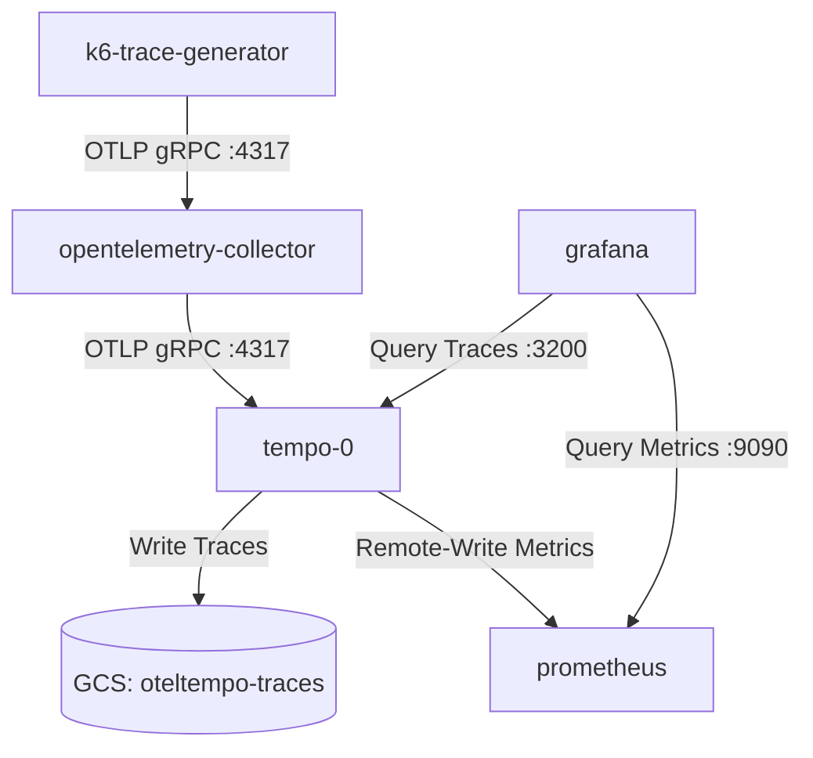
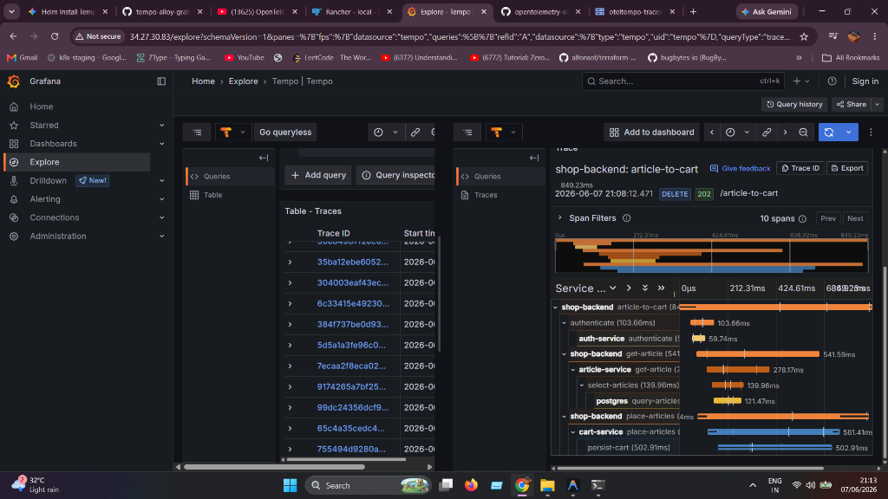
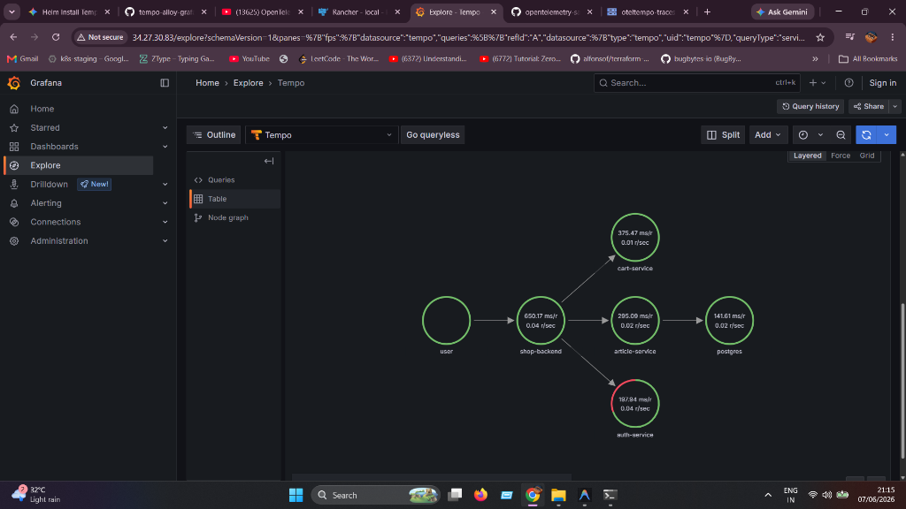

# OpenTelemetry & Tempo Tracing Stack

This directory contains the Helm values and Kubernetes manifests to deploy a complete distributed tracing stack on Google Kubernetes Engine (GKE) using **Grafana Tempo**, **OpenTelemetry Collector**, **Prometheus/Grafana Stack**, and a synthetic **k6 Trace Generator**.

---

## Architecture Flow

The telemetry data and metrics flow through the system as follows:



1. **Trace Generation**: The `k6-trace-generator` pod creates synthetic traces and sends them to the OpenTelemetry Collector.
2. **Collection & Export**: The `opentelemetry-collector` receives traces via OTLP and forwards them to `tempo`.
3. **Storage & Processing**:
   * **Traces**: Grafana Tempo stores the raw traces in a Google Cloud Storage (GCS) bucket (`oteltempo-traces`).
   * **Metrics**: Tempo's internal **Metrics Generator** processes incoming spans to compute **Service Graphs** and **Span Metrics**, which it remote-writes directly to Prometheus.
4. **Visualization**: Grafana queries traces from Tempo (port `3200`) and service graph metrics from Prometheus (port `9090`) to render Explore Traces and Service Graph visualisations.

---

## Prerequisites & IAM Setup

### GCS Bucket
A GCS bucket named `oteltempo-traces` must exist in your GCP project.

### Workload Identity
Tempo uses GKE Workload Identity to authenticate with Google Cloud Storage without static credentials.
1. The Google Service Account (GSA) `tempo-gcs-sa@<project-id>.iam.gserviceaccount.com` must be bound to the Kubernetes Service Account (KSA) `tempo` in the `monitoring` namespace.
2. The GSA must have the following IAM roles on the bucket:
   * **Storage Object Admin** (`roles/storage.objectAdmin`): To read and write span blocks.
   * **Storage Legacy Bucket Reader** (`roles/storage.legacyBucketReader`): Required for bucket metadata access (i.e. `storage.buckets.get` permission).

Example command to add the legacy bucket reader role:
```bash
gcloud storage buckets add-iam-policy-binding gs://oteltempo-traces \
  --member="serviceAccount:tempo-gcs-sa@<project-id>.iam.gserviceaccount.com" \
  --role="roles/storage.legacyBucketReader"
```

---

## Deployment Steps

All resources should be deployed to the `monitoring` namespace:

```bash
kubectl create namespace monitoring
```

### 1. Add Helm Repositories
```bash
helm repo add grafana https://grafana.github.io/helm-charts
helm repo add open-telemetry https://open-telemetry.github.io/opentelemetry-helm-charts
helm repo add prometheus-community https://prometheus-community.github.io/helm-charts
helm repo update
```

### 2. Deploy Prometheus + Grafana Stack
Deploy the monitoring stack with remote-write receiver and exemplars enabled, along with the Tempo datasource:
```bash
helm install monitoring prometheus-community/kube-prometheus-stack \
  --version 72.6.2 \
  --namespace monitoring \
  --values tracing/tempo-opentelemetry/helm/prometheus-grafana-stack.yaml \
  --wait
```

### 3. Deploy Grafana Tempo
Deploy Tempo configured with GCS backend storage and the metrics generator enabled:
```bash
helm install tempo grafana-community/tempo \
  --version 1.24.4 \
  --namespace monitoring \
  --values tracing/tempo-opentelemetry/helm/tempo.yaml \
  --wait
```

### 4. Deploy OpenTelemetry Collector
Deploy the collector to receive OTLP traces and export them to Tempo:
```bash
helm install opentelemetry-collector open-telemetry/opentelemetry-collector \
  --namespace monitoring \
  --values tracing/tempo-opentelemetry/helm/otel-collector-values.yaml \
  --wait
```

### 5. Deploy Trace Generator
Apply the synthetic trace generator deployment:
```bash
kubectl apply -f tracing/tempo-opentelemetry/trace-generator.yaml
```

---

## Configuration Reference

### Grafana Datasource (`prometheus-grafana-stack.yaml`)
Connecting Grafana to Tempo requires using port `3200` (Tempo HTTP query API port) instead of Loki's default `3100`:
```yaml
datasources:
  datasources.yaml:
    apiVersion: 1
    datasources:
      - name: Tempo
        type: tempo
        access: proxy
        url: http://tempo:3200
        uid: tempo
```

### Tempo Configuration (`tempo.yaml`)
To generate service graphs and span metrics, `metricsGenerator` is enabled and configured with a remote-write endpoint targeting the Prometheus server:
```yaml
tempo:
  metricsGenerator:
    enabled: true
    remoteWriteUrl: "http://monitoring-kube-prometheus-prometheus:9090/api/v1/write"

  overrides:
    defaults:
      metrics_generator:
        processors: [service-graphs, span-metrics, local-blocks]
```

### OpenTelemetry Collector (`otel-collector-values.yaml`)
Explicitly uses the GitHub Container Registry image for the Kubernetes distribution and forwards OTLP traces to the `tempo` service:
```yaml
image:
  repository: "ghcr.io/open-telemetry/opentelemetry-collector-releases/opentelemetry-collector-k8s"

config:
  exporters:
    otlp:
      endpoint: "tempo:4317"
      tls:
        insecure: true
```

---

## Verification & Troubleshooting

### 1. Check Pod Statuses
Ensure all pods are running successfully:
```bash
kubectl get pods -n monitoring
```

### 2. Verify Tempo Logs
Check the Tempo logs to confirm it has successfully initialized GCS storage and started the Remote-Write metrics watcher:
```bash
kubectl logs statefulset/tempo -n monitoring -c tempo
```
You should see output similar to:
```text
level=info msg="Tempo started"
level=info msg="Starting WAL watcher" ... url=http://monitoring-kube-prometheus-prometheus:9090/api/v1/write
```

### 3. Visualise in Grafana
* Access the Grafana external load balancer URL (e.g. `http://<grafana-loadbalancer-ip>`).
* Navigate to **Explore** and select the **Tempo** datasource.
* Use **TraceQL** or the **Search** tab to search for traces.
* Navigate to the **Service Graph** tab inside Grafana to view the visual dependency topology map of your services.

#### Query Traces In Grafana Explore
Here is a sample timeline visualisation of a trace (`shop-backend: article-to-cart`) in Grafana:



#### Service Graph In Grafana Explore
Here is the generated service graph topology showing the flow from `user` -> `shop-backend` to the individual microservices:



